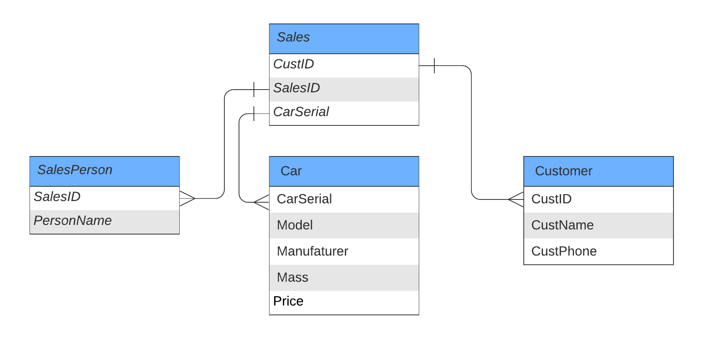

# 2. Database
This section contains the design and development of the database, as well as querying the database.

## Schema


The above schema presents the relationship between tables in the database.

Below are the descriptions of the tables:

| Table Name | Description |
| --- | --- |
| SalesPerson | Contains salespersons' names and their unique ID |
| Customer | Contains customer name, phone number and a unique ID |
| Car | Contains the car serial number, model, manufacturer, weight (mass) and price |
| Sales | Aggregated table containing foreign keys referring to SalesPerson, Car and Customer tables |

## Building and Running the Database
To build and run the database with a set of [predetermined data](./generate_data.sql), run `./build_and_run.sh -v /path/to/volume/to/mount`.

This will build and run the container, as well as run the queries. You should see the results print out in the console.

To exit and remove container, run `docker compose down`. 

To restart the container, run `docker compose start`
To access the restarted container, run `docker compose exec postgres_db sh`

## Expected Output
### Generating Dababase
You should see these cluster of logs (an example from each cluster is shown):
```
[Create table logs] 
...
postgres_db  | CREATE TABLE
postgres_db  | 2022-01-15 05:44:07.610 UTC [64] LOG:  statement: CREATE TABLE IF NOT EXISTS SalesPersons (
postgres_db  | 	    SalesID bigint NOT NULL PRIMARY KEY,
postgres_db  | 	    PersonName text NOT NULL
postgres_db  | 	);
...
[Add data into tables]
...
postgres_db  | INSERT 0 38
postgres_db  | 2022-01-15 05:44:07.640 UTC [66] LOG:  statement: INSERT  INTO SalesPersons (SalesID, PersonName)
postgres_db  | 	VALUES (1, 'John Smith'),
postgres_db  | 	       (2, 'Sarah Sally'),
postgres_db  | 	       (3, 'Rainy Vera'),
postgres_db  | 	       (4, 'Jean Avery'),
postgres_db  | 	       (5, 'Operah Pen'),
postgres_db  | 	       (6, 'Vimy Lucy')
...
```

### Generating Query Results
The query results are:
```
postgres_db  | /usr/local/bin/docker-entrypoint.sh: running /docker-entrypoint-initdb.d/query1.sql
postgres_db  | 2022-01-15 05:44:07.663 UTC [68] LOG:  statement: SELECT CustName, SalesVolume
postgres_db  | 	FROM (SELECT Sales.CustID, Customer.CustName as CustName, SUM(Cars.Price) as SalesVolume
postgres_db  | 	FROM Customer, Sales, Cars
postgres_db  | 	WHERE Sales.CustID = Customer.CustID
postgres_db  | 	AND Sales.CarSerial = Cars.CarSerial
postgres_db  | 	GROUP BY Sales.CustID, Customer.CustName
postgres_db  | 	ORDER BY SalesVolume DESC) as CustSpending;
postgres_db  |    custname   | salesvolume
postgres_db  | --------------+-------------
postgres_db  |  Frank Mill   |     1580000
postgres_db  |  Jane Doe     |     1335300
postgres_db  |  Francis P    |     1210000
postgres_db  |  Zenia M      |      850000
postgres_db  |  Kim J        |      500000
postgres_db  |  Zoe Am       |      420000
postgres_db  |  Billy H      |      350000
postgres_db  |  Emilia Sarah |      175000
postgres_db  | (8 rows)
```

and

```
postgres_db  | /usr/local/bin/docker-entrypoint.sh: running /docker-entrypoint-initdb.d/query2.sql
postgres_db  | 2022-01-15 05:44:07.689 UTC [70] LOG:  statement: SELECT Cars.Manufacturer as Manufacturer, COUNT(Sales.CarSerial) as CarsSold FROM Cars, Sales
postgres_db  | 	WHERE Sales.CarSerial = Cars.CarSerial
postgres_db  | 	GROUP BY Manufacturer
postgres_db  | 	ORDER BY CarsSold DESC
postgres_db  | 	LIMIT 3;
postgres_db  |  manufacturer | carssold
postgres_db  | --------------+----------
postgres_db  |  Audi         |        4
postgres_db  |  McLaren      |        3
postgres_db  |  Tesla        |        2
postgres_db  | (3 rows)
```

<br>

# Further Study
Given more time, I would like to explore selected statement logging so that the statement loggings do not overwhelm the console logs. In addition, I would also like to explore other aspects of docker compose like running up multiple containers and enabling distributed data persistence. 

