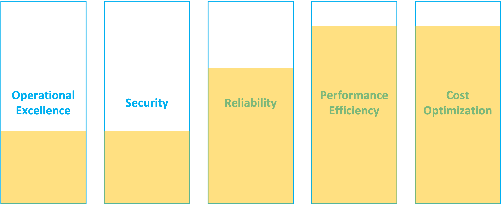
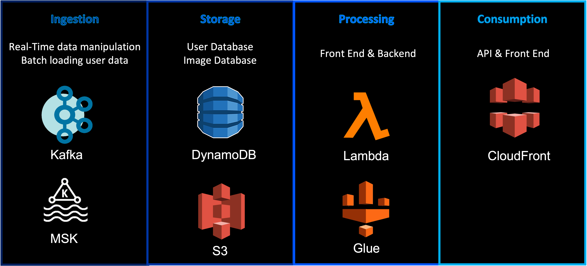
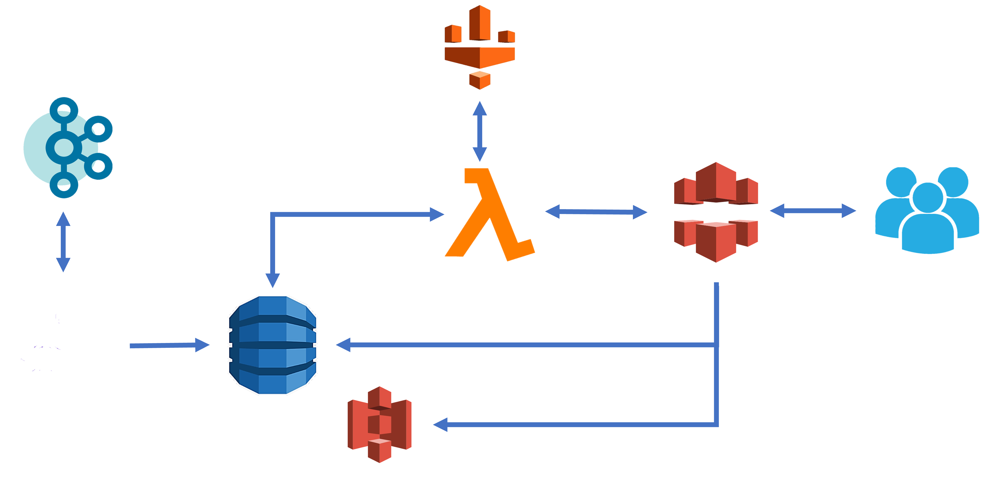

# 3. System Design Architecture
This section contains the thought process and final architecture diagram.

 

## TOC
- [Dataset](#dataset)
  * [_One country_](#-one-country-)
  * [_Actual_](#-actual-)
- [Running the processes](#running-the-processes)
- [Visualizations](#visualizations)
- [Conclusion](#conclusion)

<small><i><a href='http://ecotrust-canada.github.io/markdown-toc/'>Table of contents generated with markdown-toc</a></i></small>

 

## Background
You are designing data infrastructure on the cloud for a company whose main business is in processing images. 

The company has a web application which collects images uploaded by customers. The company also has a separate web application which provides a stream of images using a Kafka stream. The company’s software engineers have already some code written to process the images. The company  would like to save processed images for a minimum of 7 days for archival purposes. Ideally, the company would also want to be able to have some Business Intelligence (BI) on key statistics including number and type of images processed, and by which customers.

## Assumptions
#### Assumptions about the market:
1. Mature market with a sizeable competitors

#### Assumptions about the data:
1. Data is not sensitive

#### Assumptions about customer intenetions:
1. Processing and returning results for users to download is the objective of the company
2. Storing analytics results and reports should last up to 5 years, unless manually deleted (analytics is key to upselling and crossing selling useful products to users).
3. Customer was a serverless approach

## AWS Well-Architectured Framework
Based on the above assumptions, below is the priority for each of the five pillars:

Performance Efficiency, Reliability and Cost Optimization are interlinked. Reliability is important, but less so than Performance Efficiency and Cost Optimization in a saturated market. 

## Requirements & Services List
Based on the framework, below are the requirements for each part (Consumption, Processing, Storage and Ingestion):

## System Design Architecture

## Conclusion
All the knowledge exhibited in this section are based on Google, AWS Documentations and YouTube videos. I do not have prior experience in this field and if given the opportunity, would love to explore more in this area.