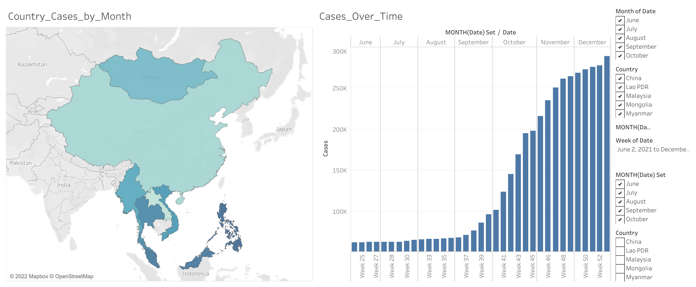

# 4. Visualize
This section contains the steps to obtaining, preparing and visualizing a given set of structured data.

<br>

## TOC
- [Dataset](#dataset)
  * [_One country_](#-one-country-)
  * [_Actual_](#-actual-)
- [Running the processes](#running-the-processes)
- [Visualizations](#visualizations)
- [Conclusion](#conclusion)

<small><i><a href='http://ecotrust-canada.github.io/markdown-toc/'>Table of contents generated with markdown-toc</a></i></small>

<br>

## Dataset
### _One country_
The data is obtained by running this command in bash:
```bash
url --location --request GET 'https://api.covid19api.com/live/country/Singapore/status/confirmed' >> Desktop/gitlab/Tech_Test/Charts_API/data.json
```

The url is obtained via the link provided in the [test instructions](../README.md).

### _Actual_
As one country is a little bland and doesn't explore the visual interactiveness of a dashboard, I have decided to include a curated list of Asian countries.

The timeframe for the data is set between June and December 2021.

Iterate through all the countries available and run `curl --location --request GET 'https://api.covid19api.com/country/{}/status/confirmed/live?from=2021-06-01T00:00:00Z&to=2021-12-31T00:00:00Z'`. 

After pulling them, they are comcatenated into a single [data file](solution/data/covid.json).

The above steps are compiled in [this script](solution/scripts/get_data.py).

<br>

## Running the processes
To run the container, run `./docker/build_and_run.sh`.
In the container, run `./scripts/get_data.py -o /path/to/save/to`.

When running the process, the data is saved at the mounted path for accessibility. Otherwise, the data cannot be accessed outside of the container.

##
You should see the following output if the container successfully builds and runs:
```
./docker/build_and_run.sh -v ~/Desktop:/home/data
Building docker image ... 
[Docker build actions ]
...                                           
/home/visualize/solution # ./scripts/get_data.py -o /home/data
Pulling data from source ...
Pulled and saved data to /home/data/covid.json
```

<br>

## Visualizations
To view the dashboards, click [here](https://public.tableau.com/views/Covid_Cases_16421503078820/Covid_Dashboard?:language=en-US&publish=yes&:display_count=n&:origin=viz_share_link). You can toggle the options on the right panel to view different combinations of the features.

The top two features are for the Country_Cases_by_Month and the remaining are for the Cases_Over_Time graph.

In case of any issues, below is a snapshot of the results:


Note: The graph only displays the cumulative case counts for Singapore.

<br>

## Conclusion
Should time not be of concern, I would like to automate the process of obtaining up-to-date data and presenting them live via the dashboard.